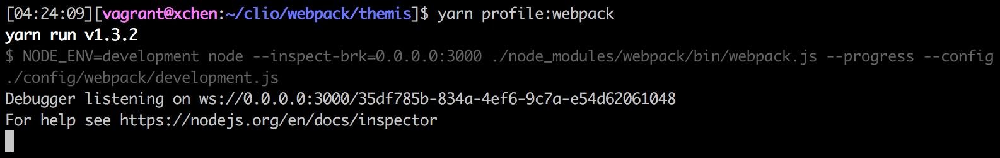
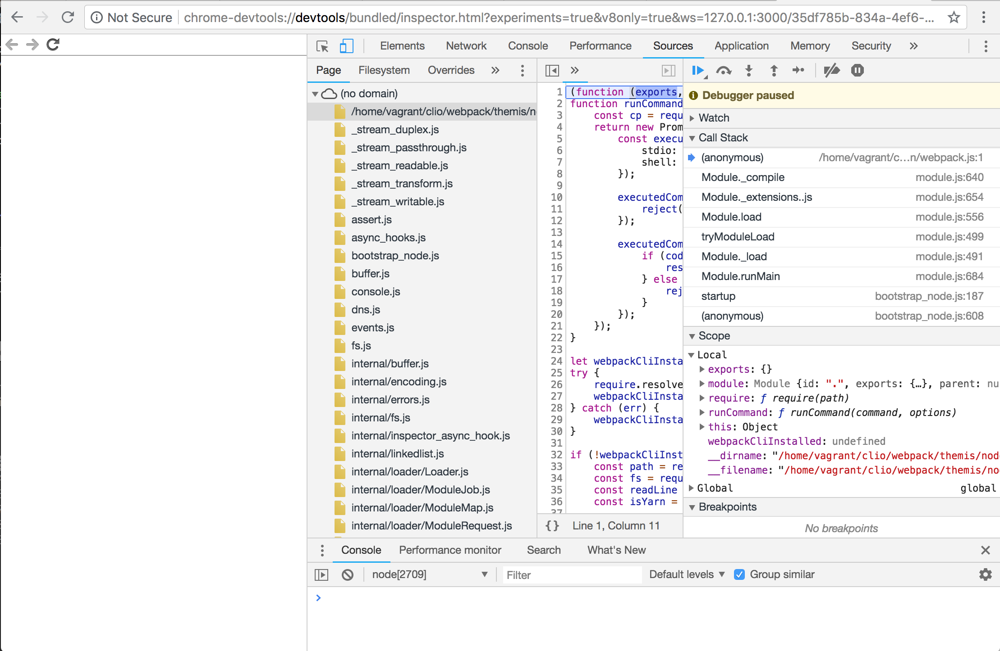

# Using Chrome Dev Tools to Debug Webpack

Of all of the tools we used in order to profile and monitor our Webpack's build process, this is by far the most sophisticated.

Back in 2016, Sean Larkin put out this [article](https://medium.com/webpack/webpack-bits-learn-and-debug-webpack-with-chrome-dev-tools-da1c5b19554) showing how he was able to Chrome Devtools to debug Webpack. This was enabled by a new (back then) feature of Node, which allowed developers to hook up an external inspector to debug Node processes.

As of Node 7.7.0, this way of debugging Node processes has become the [endorsed standard](https://nodejs.org/en/docs/guides/debugging-getting-started/).

Chrome Devtools provides many tools for working with JavaScript. One of these is the "Memory" panel, which allows developers to take snapshots of the JavaScript heap during a process' execution. So we thought:

"Why don't we use Chrome Devtools to peek into our Webpack's build and see who's gobbling up all that memory?"

So how?

Well, first, we created a command:

```bash
"profile:webpack": "NODE_ENV=development node --inspect-brk=0.0.0.0:3000 ./node_modules/webpack/bin/webpack.js --progress --config ./config/webpack/development.js",
```

When we run this command, we get the following console output:



So a new Node process has been started and it is currently waiting for a debugger connection.

Next, we opened up a new Chrome window and accessed:
```
http://127.0.0.1:3000/json/list
```

This returned a JSON object:

```json
[ {
  "description": "node.js instance",
  "devtoolsFrontendUrl": "chrome-devtools://devtools/bundled/inspector.html?experiments=true&v8only=true&ws=198.51.100.207:3000/0a0e59ab-f104-4157-aae8-212a839478e0",
  "faviconUrl": "https://nodejs.org/static/favicon.ico",
  "id": "0a0e59ab-f104-4157-aae8-212a839478e0",
  "title": "./node_modules/webpack/bin/webpack.js",
  "type": "node",
  "url": "file:///home/vagrant/clio/webpack/themis/node_modules/webpack/bin/webpack.js",
  "webSocketDebuggerUrl": "ws://198.51.100.207:3000/0a0e59ab-f104-4157-aae8-212a839478e0"
} ]
```

Open another tab and paste in the link under `devtoolsFrontendUrl`, and you should see something like:



Whoa, that's CRAZY. You've just managed to connect the Chrome Devtools to the Node process running Webpack! When you hit that play button, the Webpack compilation process will start! Best of all, you can do everything you would normally do within the Chrome Devtools, meaning you can now use the Memory panel to monitor Webpack's memory usage!
