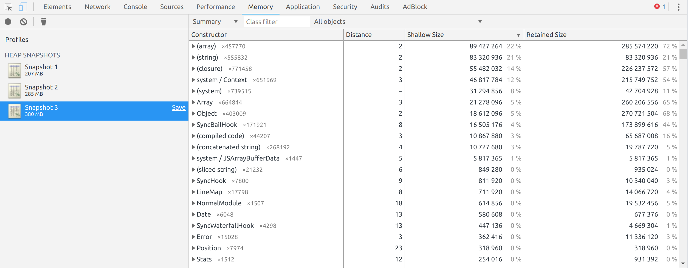

# Wrangling with Webpack - pt.2 - On the Subject of Memory

*Working Draft*

**Link to Article 1**

## Introduction

This is the second of a two-part series on how we use Webpack here at Clio. Last time, I talked briefly about the problems we faced running Webpack on our CI provider before transitioning into an exposition on our upgrade path to Webpack v4. The narrative then ended before I had a chance to explain how we actually dealt with our memory issues. In this sequel, I will dive into this memory issue in detail. Welcome to part two, :zap: Electric Boogaloo :zap:.

### Disclaimer

This is a rather long article, so, before continuing any further, I would like to mention a couple things. First, this article **does not** contain a perfect solution to resolving all Webpack-related memory issues. In fact, we ourselves are still in the process of looking for additional optimizations to our Webpack project, which, I'm sure others will agree, is a tricky business.

Looking back on the solutions we developed, I realized just how project-specific they were. Thus, I was convinced that the most valuable part of our investigation was not the ultimate outcomes, but rather the process itself. As such, what follows in this article is a collection of diagnostic tools and methods for profiling Webpack's resource consumption during compilation.

Because the journey is more important than the destination (Or so I've been told), this article details all of the different methods we've tried, regardless of whether or not they "worked." I am hoping that these ideas will prove useful to anyone who has experienced similar issues as us, or is simply interested in diving deeper into their Webpack project. You may find that none of these will be of any use to you, in that case, I apologize. But how would you know that without reading on?

Okay, I'm done with this disclaimer. On with the show.

## Can You Repeat the Problem?

To set the stage, I would like to begin this article by reiterating the issue that was introduced in the last article.

We use Buildkite as our CI provider, and AWS EC2 instances to actually run our CI processes. When a developer pushes a new commit up to our Github repo, Buildkite is notified via webhooks and will create a new build for this commit in each of our CI pipelines.

We have multiple pipelines for doing all sorts of stuff, but the focus of this article is on the compile pipeline, which is used to automatically compile our front-end assets. When Buildkite creates a build, it will allocate an AWS EC2 instance and install an "agent" on this machine. The agent is basically a script that will begin running the processes defined in the pipeline on the machine it was installed on:

1. It clones our application repo and checks out the commit that triggered the build
2. It prepares the build environment, doing things such as installing Node modules
3. It compiles all of the assets in the Rails asset pipeline (mainly used for our legacy application)
4. It compiles our revamped application, Apollo, using Webpack

This pipeline worked great, until it didn't. Our AWS EC2 instances are of type `c5.large` and have 4gb of memory. Because of other processes that run concurrently with Webpack during compilation, our Production Engineering team has explained to us that we need to ensure Webpack take no more than 2gb of memory at any given time during the build. When Webpack starts to exceed this limit, we begin to experience transient build failures in the compile pipeline.

Now that the problem has been clearly identified, let's talk about how we tried to deal with it.

## The Blackbox Approach

### TL;DR

* Good tooling is essential: without it, you can't properly diagnose a problem nor can you validate different hypotheses
* Use `ps ufaxww` to see all Webpack-related processes and their resources consumption
* Node allows you to control the size of V8's old space with `--max-old-space-size=VALUE`; setting a lower value can help reduce the amount of memory Webpack takes to compile your project, at the cost of longer compile times
* Using `--max-old-space-size` to control Webpack memory consumption is fragile; if the old space size is too low, Webpack compilation will fail. This means that as the size of your Webpack project grows, the old space size limit has to be adjusted accordingly

We began with what could be considered a "blackbox" approach. In this approach, we treated our Webpack project as a "black box" that can only be examined and controlled from the outside.

No matter how complex your Webpack project may be, Webpack is still just a Node program that must conform to all of the normal rules that apply to any other Node program.

This means two things. First, when Webpack is running, you should be able to examine it using the `ps` utility. Second, because it is a Node program, you should be able to configure the Node process that runs it using standard CLI options, such as `--max-old-space-size`.

Let me show you how we used these tools.

To begin our analysis, we took the command that we use to compile Apollo on CI:
```
NODE_ENV=production webpack --progress --config ./config/webpack/production.js
```

And stuck it into our `package.json` as a script:
```JSON
{
  "scripts": {
    "build:webpack": "NODE_ENV=production webpack --progress --config ./config/webpack/production.js"    
  }
}
```

This allowed us run our Webpack compilation simply by typing `yarn build:webpack`.

With Webpack running, we opened up another terminal window and executed:
```
ps ufaxww
```

`ps` is a Unix utility for printing out a snapshot of all active processes. By passing `ufaxww`, the output will show you the details of all active processes and also group together parents with their child processes.

For example, here is the output we saw when we ran this command, truncated to focus on Webpack-related processes:

```sh
vagrant   3617  0.8  1.0 1138236 64720 pts/0   Sl+  17:45   0:00  node /usr/local/bin/yarn build:webpack
vagrant   3627  0.0  0.0   4300   772 pts/0    S+   17:45   0:00   \_ /bin/sh -c NODE_ENV=production node ./node_modules/webpack/bin/webpack.js --progress --config ./config/webpack/production.js
vagrant   3628 68.7  9.7 1700668 599088 pts/0  Rl+  17:45   0:29       \_ node ./node_modules/webpack/bin/webpack.js --progress --config ./config/webpack/production.js
vagrant   3634 27.5  5.6 1151908 345332 pts/0  Sl+  17:45   0:11           \_ /usr/local/stow/nodejs-8.9.4/bin/node /home/vagrant/clio/webpack/themis/node_modules/fork-ts-checker-webpack-plugin/lib/service.js
```

The sixth column from the left represents the amount of physical memory (in kb) being consumed by the process on that line. The first two lines are actually generated by `yarn`, which we were using to execute the `build:webpack` command. The third line is the actual Webpack process. The forth line is a parallel process spawned by a plugin called `fork-ts-checker-webpack-plugin` which we use to try and speed up our build. All in all, Webpack was consuming roughly 944mb of memory when this snapshot was taken.

Now that we had a sense of what was actually running when Webpack begins, we got rid of the extraneous output and asked for a summary statistic instead:
```
ps uax | grep webpack | awk '{s+=$6} END {print s}
```

This command will filter down the output from `ps` to only lines that contain the string "webpack". It then adds together the sixth column from each row and prints it out. In effect, running this command gave us a snapshot of how much memory Webpack was using in total. Depending on your situation, you may find it necessary to use a different filter, but for us, `grep webpack` was sufficient.

But a single snapshot is not all that useful. So we made a Node script:

```js
// profile-memory.js
var process = require("process");
var childProcess = require("child_process");

var repeating = setInterval(
  function() {
    childProcess.exec(
      "ps uax | grep webpack | awk '{s+=$6} END {print s}'",
      function(_err, stdout) {
        process.stdout.write(stdout.trim() + ",\n");
      }
    )
  },
  100
);

const webpack = childProcess.spawn("yarn", ["build:webpack"])
  .on("close", () => {
    clearInterval(repeating);
  });

webpack.stderr.on("data", (data) => {
  process.stderr.write(data);
});
```

When executed, `profile-memory.js` starts a new Webpack build. Then, as the build runs, a function is executed every 10th of a second that grabs the total memory being used and writes the result to standard output. Conveniently, the output of the script has been designed to be easily consumable by graphing applications.

We ran the script three times and uploaded the files to [plot.ly](https://plot.ly) to create this graph. :chart_with_upwards_trend:


https://plot.ly/~XiaoChenClio/16/

As you can see, with our current configuration, Webpack finishes compilation in around 120 ~ 130s. At the very most, our Webpack compilation appears to use about 2 million kilobytes (2gb) of memory.

Now that we had an idea of what our Webpack build costs, what could we do? Well, this is where some knowledge about Node came in handy. Node uses V8 and can accept a number of command line options that configure the way V8 behaves. One of these is `--max-old-space-size`. To summarize Irina's [post](https://medium.com/@_lrlna/garbage-collection-in-v8-an-illustrated-guide-d24a952ee3b8), V8's memory management strategy divides up the heap into two parts: old space and new space. Objects in the old space are not subject to the frequent scavenging that occurs in the new space and are only garbage-collected when its capacity is reached. Therefore, if you set a lower capacity on the old space than the V8 default, it should cause more garbage collections, which means less memory used throughout compilation. `--max-old-space-size` accepts a single number, interpreted as the maximum size of the old space in megabytes.

So, with this knowledge, we changed our `build:webpack` command so that we can control the size of the old space:

```
"build:webpack": "NODE_ENV=production node --max-old-space-size=SIZE ./node_modules/webpack/bin/webpack.js --progress --config ./config/webpack/production.js",
```

We tried three different values for `SIZE`: 1024, 896 and 768. Our project compiled successfully at both 1024 and 896, but failed at 768. Using `profile-memory.js`, the results of the two successful trials were logged. We created a graph to compare the results:


https://plot.ly/~XiaoChenClio/1/

As we reduced the maximum size of the old space, Webpack took longer to build our project because the V8 engine had to spent more time in garbage collection, but the amount of memory it consumed also decreased. We found `--max-old-space-size=1024` to be a sweet spot, as it reduced the the maximum memory used by around 400mb, at the acceptable cost of +10s in total compile time.

It is also worth noting `--max-old-space-size` will have no effect on parallel processes spawned during compilation, such as `fork-ts-checker`. It only affects the immediate Node process it is passed to.

Ultimately, however, the effectiveness of the blackbox methods described above is limited. First, while `profile-memory.js` tells you exactly how much of the system's resources Webpack is using, when used on its own, it doesn't tell you **why** Webpack needs all of that memory. Second, while limiting the maximum size of the old space can help reduce memory usage, it comes at the cost of longer runtimes and have to be adjusted over time as your project scales and grows.

Even though the blackbox approach did not provide us with a satisfactory solution, it still gave us a foundation from which we could dive deeper into the Webpack jungle. Put on your safari hats, it's time for a whitebox approach.

## The Whitebox Approach

### TL;DR

* Identify and profile memory consumers in your Webpack set-up. Know what pieces incur the heaviest cost and prioritize optimization efforts accordingly
* If the time trade-off is acceptable, reduce the number of processes that are running parallel on the same machine
* Scale horizontally (Across multiple machines) if possible

In the whitebox approach, we "unpacked" our Webpack project in search of one thing and one thing only: the cause of Webpack's voracious demand for memory. In an ideal world, we would have identified a single issue, perhaps an non-optimized plugin, that both used a lot of memory and for which a more optimized alternative exists. However, if this were the case, I would have told you about it by now.

The reality, as you can tell, did not turn out so neatly. In this last section, I will show you three different methods you may use to identify memory bottlenecks in a Webpack project. Then, at the very end, I will offer some ideas that may be helpful if you are working with a tight memory constraint.

### Method 1: Profiling plugins and loaders

In our first strategy, we examined the way we configured Webpack. Generally speaking, a Webpack project is configurable in three different ways: by adjusting Webpack's native options, by adding custom plugins, and by adding custom loaders. In our case, since we did not see anything suspicious with our native options, we focused on our plugins and loaders instead.

Beginning with the plugins we used in our production environment, we disabled each of them individually (Most of the time, this was as simple as just commenting it out of our `plugins` array) and ran `profile-memory.js` to get an idea of how much memory overhead it added during compilation.

For example, one of the plugins we were using was the [ForkTsCheckerWebpackPlugin](github.com/Realytics/fork-ts-checker-webpack-plugin), which helped speed up our Webpack compilation by creating a separate process to perform all TypeScript typechecking. We disabled it and ran `profile-memory.js`. The results were then recorded:


https://plot.ly/~XiaoChenClio/12

As surprising as this result was, it was also somewhat of a red herring. Without ForkTsChecker, not only was maximum memory usage lowered by around 200mb, but the total compile time was also about 20s shorter. However, This was purely due to the fact that, without ForkTsChecker and without re-enabling typeschecking in `ts-loader`, Webpack was no longer performing any form of typechecking during compilation. Of course, we couldn't just forgo typechecking all-together, but this discovery did give us an idea that will be elaborated upon shortly.

For the record, we also found [SourceMapDevToolPlugin](https://webpack.js.org/plugins/source-map-dev-tool-plugin/) and [UglifyjsWebpackPlugin](https://webpack.js.org/plugins/uglifyjs-webpack-plugin/) to be heavy consumers of memory as well. But we couldn't find a good way to use this information.

We then applied this process of "isolate-and-compile" to our loaders. We did this by using the [IgnoreLoader](https://github.com/cherrry/ignore-loader). So, for example, to measure the impact of the loaders we were using for CoffeeScript files, we would update our configuration like so:

```js
// webpack configuration snippet
module.exports = {
  // ... Other configuration
  module: {
    rules: [
      {
        test: /\.coffee(\.erb)?$/,
        // loader: 'ng-annotate-loader!coffee-loader' // Comment out the actual loaders
        loader: 'ignore-loader', // Tell Webpack to ignore all CoffeeScript files
      },
      // ... other rules
    ],
  },
}
```

The results of these tests, however, were not as useful as the plugins beforehand. We found that the loaders that incurred the heaviest memory tax were our TypeScript, CoffeeScript, and Sass loaders, but this was largely due to fact that these were the most common types of files in our project. We couldn't really replace these loaders: doing so would most likely achieve little, and comes with the risk of hard-to-detect breakages.

### Method 2: Profile imports

So let's talk about the second strategy, which focuses instead on the actual bundles that Webpack generates. Here, we started by using the [Webpack Bundle Analyzer](https://github.com/webpack-contrib/webpack-bundle-analyzer) to visualize the shapes and sizes of our final, compiled bundles.

The graph that we received from the Analyzer was very telling:


The majority of our bundled JavaScript assets, as it turned out, came from our `node_modules` folder! What's more, within the code from `node_modules`, the largest part was by far from `lib-ThemisUI`, an internal component library that we created for our app.

Intrigued, we wanted to see what would happen to our compilation if we were to take `lib-ThemisUI` out of the picture. To do this, we used Webpack's [IgnorePlugin](https://webpack.js.org/plugins/ignore-plugin/) to ignore all attempts to import anything from `lib-ThemisUI`:

```js
// webpack configuration snippet
module.exports = {
  // ... Other configuration
  plugins: [
    new webpack.IgnorePlugin(/lib-ThemisUI/),
    // ... other plugins
  ],
}
```

 We profiled our compilation again and recorded the results (If you are wondering why the compile times are faster, it's because these tests were ran on a slightly faster machine than the previous tests):


https://plot.ly/~XiaoChenClio/28/

Without processing the files from `lib-ThemisUI`, we saw a reduction in both compilation time (-15s) and maximum memory used (-150mb). But even more interestingly, you can see that the curves of the two compilations are almost identical up until around 75s (x=750) into compilation. This, incidentally, was when Webpack started performing output-optimization tasks like uglification and source map generation.

What was happening? Well, when our app includes `lib-ThemisUI`, it is actually consuming several bundled files as opposed to the actual source code for our component library. Therefore, the files from `lib-ThemisUI` does not really play a major role for most of the compilation process. But, because they ultimately get included in the assets generated, the bundled files from `lib-ThemisUI` *does* participate in the output-optimization stage.

One possible solution would have been to look for some way to prevent this: to be more specific, we could try to optimize `lib-ThemisUI`'s bundled files separately, and thus take that responsibility (and cost) away from our app's compilation. For a variety of reasons, we decided not to pursue this path for the moment. We felt that the larger issue at hand was the sheer size of our component library: it is, shall we say, abnormal, that our component library is almost the size of our entire application itself. As a result, until we could figure out a way to reduce the size of `lib-ThemisUI`, we decided to put this path on hold.

### Method 3: Profile using Node's inspector

Let's now talk about the last strategy, which is, in my opinion, the fanciest of them all. NodeJS has a pretty awesome [inspect feature](https://nodejs.org/en/docs/guides/debugging-getting-started/) that allows you to connect an inspector of your choice to debug Node applications.

Knowing this, we promptly added an additional command to our `package.json`:

```JSON
{
  "scripts": {
    "profile:webpack": "NODE_ENV=production node --inspect-brk=0.0.0.0:3000 ./node_modules/webpack/bin/webpack.js --progress --config ./config/webpack/production.js",
  }
}
```

Running `yarn profile:webpack` now gave us the following output:

```
yarn run v1.9.4
$ NODE_ENV=production node --inspect-brk=0.0.0.0:3000 ./node_modules/webpack/bin/webpack.js --progress --config ./config/webpack/production.js
Debugger listening on ws://0.0.0.0:3000/6333b371-51fb-4fec-8729-fc025df01336
For help, see: https://nodejs.org/en/docs/inspector
```

With this running in our terminal, we opened up Chrome and accessed `http://0.0.0.0:3000/json/list`. This yielded us a simple response:

```
[ {
  "description": "node.js instance",
  "devtoolsFrontendUrl": "chrome-devtools://devtools/bundled/inspector.html?experiments=true&v8only=true&ws=127.0.0.1:3000/e218191b-8335-43ec-80e3-85e3a8da5c4f",
  "faviconUrl": "https://nodejs.org/static/favicon.ico",
  "id": "e218191b-8335-43ec-80e3-85e3a8da5c4f",
  "title": "./node_modules/webpack/bin/webpack.js",
  "type": "node",
  "url": "file:///home/shawn/Documents/themis/node_modules/webpack/bin/webpack.js",
  "webSocketDebuggerUrl": "ws://127.0.0.1:3000/e218191b-8335-43ec-80e3-85e3a8da5c4f"
} ]
```

Pasting the value of `devtoolsFrontendUrl` into the address bar, we were greeted with the familiar UI of the Chrome devtools:


Let's take a moment to appreciate what's happening: We started up a Node process that is going to run Webpack. Then, we opened Chrome and connected to this process. Now, as you can see, we had the Chrome devtools open with the code for Webpack loaded in and ready to go. Once the blue play button is pressed, compilation will begin, and we will be able to monitor and debug Webpack just like any other JavaScript web app! (Props to all those who made this dark magic possible.)

Our focus was, of course, in the Memory tab.


As you can see, Chrome gives you several ways to monitor the heap of the running process. For our purposes, we first tried the heap snapshot option. This allowed us to capture and preserve exactly what the heap looked like at various moments throughout compilation (Earlier snapshots listed first):


Unfortunately, the output was a bit confounding. For one, we weren't sure exactly what to make of the numbers beneath each individual snapshot. Of course, this number appears to represent the total size of all objects in the heap at the time the snapshot was taken. But if that were the case, then they seemed way too low. Now, it was comforting to see that the snapshots taken later in the compilation had higher numbers than the earlier ones, but that still doesn't explain why these numbers are so low.

Selecting one of the snapshots will show you a detailed breakdown:



In the detailed view, the objects in the heap are grouped by their constructor. The column "Shallow Size" can essentially be thought of as the total size of all the objects within that group. There are some interesting things here, such as the `(string)` row which contained over 500 thousand individual items: these were the strings that Webpack eventually concatenates together to form your bundled assets.

Unfortunately, aside from giving us a (perhaps accurate) view into the heap, we weren't able to gleam much more from these snapshots. The verbosity of the output made it difficult to extract any useful information.

The allocation timeline also provides an interesting view into your Webpack build, As the name suggests, it gives you the ability to record memory activity over a small period of time, providing you with a view of what parts of the Webpack compilation is allocating/deallocating and when they are doing it. But, similar to the heap snapshots, we found it difficult to read the output from this as well.

### Working with memory constraints

So, what can you do to try and deal with memory constraints? If you cannot immediately decrease the amount of memory needed to compile, there are two ways to work around it:

* Find opportunities to parallelize processes onto different machines
* Find opportunities to flatten processes on the same machine

Let me give you an example of each.

Most Webpack projects will use various loaders to perform pre-processing on the source files before they are actually concatenated together to form the final bundled asset files. Some loaders may not transform the source code, but simply perform a series of validations (Think linters, for example). Some of these validations do not actually need to be ran in order for Webpack to compile. If this is the case, then you might have an opportunity to parallelize.

For example, we saw earlier how Webpack was still able to compile after we have disabled Typescript typechecking entirely. Knowing this, we recognized a parallelization opportunity:
1. Disable typechecking in the compile pipeline
2. Create a separate step within the compile pipeline that simply does typechecking.

With this set-up, we were able to remove the costs of Typescript typechecking from our main compilation step, which runs on one machine, and separate it out onto a different step, which runs on another machine. This way, we still have all of the benefits of typechecking, without worrying about the costs that it incurs on compilation.

What about flattening processes? What does that mean? It's actually fairly simple: do not run any processes concurrently unless you have to. For example, we use the `webpacker` gem to integrate a Webpack-based front-end into a Rails-based back-end. By using `webpacker`, we are able to compile both our legacy application and Apollo by running `assets:precompile`.

On the machine, this would first begin a Ruby process that compiles the legacy assets, then a Node process that runs Webpack. We discovered, however, that when the legacy compilation has completed and Webpack has started, the Ruby process still hung around and consumed a chunk of memory even though it no longer had any good reason to do so. As such, we removed Webpack from `assets:precompile` by using an [env variable](https://github.com/rails/webpacker/blob/master/CHANGELOG.md#added-gem-1), and ran Webpack separately. This way, the Ruby process will end before Webpack begins.

## Conclusion

Whew, that took a while. Thanks for sticking with me, I will make this short and sweet.

So, ultimately, we didn't really "solve" our memory issue. In many ways, this article was more about various different ways to profile Webpack's memory performance. Perhaps the constraints that we were setting on ourselves are unrealistic, maybe Webpack really needed that much memory in order to finish, but this exercise in memory optimization nevertheless revealed valuable information about our project that we did not have before. Hope you liked it.
